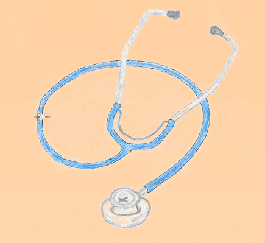

# doctor-practice-demo
Demo app which covers a work in a doctor practice; Technology: Spring Boot, PostgreSQL, Thymeleaf, Bootstrap...

 

### THE SPRING BOOT APPLICATION 'DoctorPracticeDemo' - large integration
  
The aim of the Spring Boot application 'DoctorPracticeDemo' is to provide the way to schedule the doctor’s appointments and create, review and share medical reports. The project integrates many technologies into it. Some of them have already been introduced in my previous two projects [VideoKlubProjekat](https://github.com/petroneris/video-club-project) and   [NewVideoClubProject](https://github.com/petroneris/new-video-club1). 

“DoctorPracticeDemo” is the web application which demonstrates a usage of the following technologies:
- Spring Boot - packaging and deployment
- Spring MVC framework – business layer
- Spring Security framework – for logging and access activities
- Spring Data JPA – ORM and transaction-driven data handling
- Spring WebSocket and messaging – for async message-driven multi-user communication (with SockJS functionality and Stomp
  functionality for chatting)
- Spring Boot Validation (with Hibernate Validator) – for server-side validation of input fields
- Spring Email – for sending emails
- Hibernate (ORM) - used together with Spring Data JPA
- PostgreSQL – RDBMS data layer
- Thymeleaf - Java template engine for processing and creating HTML, XML,JavaScript, CSS, and text, all in a servlet-
  compatible way
- Bootstrap + JQuery: front-end framework (css + js)
- AJAX in front-end via jQuery standard library AJAX support
- JSON data handling with Jackson library
- Flying Saucer as a CSS renderer that supports PDF output with iText 5.x
- Slf4j-with-Logback library - for (server-side) logging

A standard Java servlet container (Tomcat) is used as a server platform.

Application is set-up to use Maven as its build system.

The code is Java8 – compliant.

A short description of coding technologies used in application design, application rules, configuration and design details are presented in [documentation](doc/DoctorPracticeDemo.pdf).

Prior to starting the application you need to create and populate PostgreSQL database as described in the document and this [sql](sql/doctor_practice.sql) file. After that please update the database and Gmail access credentials with your own values in [application.properties](src/main/resources/application.properties) file. In the file [MailComponent.java](src/main/java/com/snezana/doctorpractice/configurations/MailComponent.java), please do the same for Gmail credentials.

Application is built in the standard Maven way:  
`mvn clean install`

The build artefact, as for each SpringBoot project is a single executable **.jar** file.

Once you have started the app, you can reach it on localhost like so:
`http://localhost:8080/DoctorPracticeDemo/`

There are no unit tests for the moment. Feel free to add your own :smiley:.

You can see the application demo video [here](video/doctor-practice-demo.mp4). You can download it as a separate file in a straightforward manner; however if you wish to clone it as part of the entire repository you will have to install [Git LFS Client](https://www.atlassian.com/git/tutorials/git-lfs) first.
